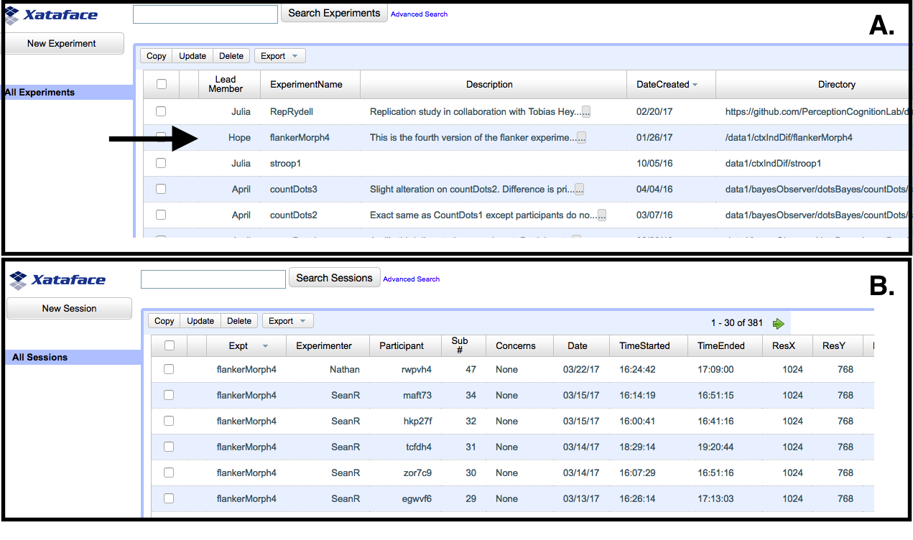

```{r include = FALSE}
library("papaja")
```

If you have been a member of a psychology lab, then perhaps you are familiar with things not going as well as planned.  You may have experienced a programming error, equipment failure, or, more likely, some rather mundane human mistake.  Our mistakes include failing to properly randomize an experiment, overwriting a file by typing in the wrong name, forgetting to notate an important code, putting relevant information in the wrong directory, analyzing the wrong data set, mislabeling figures, and mistyping test statistic values when transcribing from output to manuscripts.  Mistakes like these are unfortunately common, and they are frustrating and time consuming to correct.  Even worse, they are potentially damaging if not caught. 

Mistakes are not only limited to immediate events in the course of doing research.  We can also think about *future mistakes*.  Future mistakes become apparent when we try to examine our materials some time in the future.  They occur because the steps we are taking today may not be replicable a few years from now.  The problem is that we rely too much on our memory, and as a consequence, the location, organization, purpose, and meaning of some of our work is lost as our memories fade. 

When we ask researchers about how they avoid current and future mistakes, many reference their well-honed sense of meticulousness in curating and documenting their lab products and activities.   Our view is that relying on personal meticulousness is neither satisfying nor effective.  It certainly doesn't work in our lab because we are not meticulous.  For us, it takes too much energy and focus to be constantly checking and rechecking ones work.  Moreover, it is difficult for us to maintain the long-term perspective needed for effective documentation.  Even those who rely meticulousness know that meticulousness itself is not fail safe.  It works fine until it doesn't.  And when it doesn't, the mistakes become a matter of personal failure with an obvious locus of blame, usually on some poor graduate student.  And what can be said other than be more careful?

In this paper we describe a more effective and more pleasant approach to minimizing mistakes.  We talk here about a *pipeline*, which refers to the sequence of operations from the collection of data all the way through the finished products such as talks and publications.   We present the concept of a *reliable pipeline*, which we believe has the potential to make science more reliable, more transparent, and more open.  The defining feature of a transparent pipeline is made with reference to a hypothetical person who is not conducting the research.  This person, the outsider, perhaps the researcher some time in the future, may be able to reproduce and scrutinize all the steps starting with the raw data and ending with the final outputs.  

In the current climate, it is easy to confuse having a reliable pipeline with open science.  Reliability refers to the success of a hypothetical outsider in reproducing and scrutinizing the pipeline.  It does not imply that the pipeline publicly shared.  Open science on the other hand describes a commitment to making the pipeline public.  It does not insure that the pipeline is reliable.  The goal of this paper is to help researchers adopt a more reliable pipeline so that they can do science with greater confidence.  Striving for greater reliability should be uncontroversial.  

Throughout this paper we will be highlighting the pipeline we used for @Snyder:etal:2018.  The end result is on the web at [https://github.com/PerceptionAndCognitionLab/ctx-flanker](https://github.com/PerceptionAndCognitionLab/ctx-flanker).  The file `paper.Rmd`, under the directory `current` instantiates the transparent pipeline.  The file is mostly text, but interspersed is code in R for analyzing the data and drawing the figures.  This file is called a markdown file, and unlike ordinary document files, it is executed.  When executed, it typesets the text, collates the bibliography, downloads the raw data, cleans them, does the analysis, and draws the figures.  In this sense, the file is the set of executable processes, from the raw data to the final output.  The output in this case is the file `paper.pdf`, which is now ready to be disseminated.  Because all the processes are encoded in the file `paper.Rmd`, all the steps from raw data to final output are fully documented and may be performed by anyone, including you, at will. 

# High Reliability Organizations

A starting point for us in designing reliable pipelines is to consider practices in high risk fields where mistakes, failures, and accidents can have devastating consequences, say in aviation, the military, the nuclear power industry, and healthcare.  Fortunately, there is a sub-discipline of management devoted to studying and improving organizations that serve in high-risk environments where accidents may be catastrophic.  Organizations that mitigate risks through ongoing processes are sometimes known as high reliability organizations, and the principles they follow are known as high reliability organization (HRO) principles [@Weick:etal:2008].

Should your lab be a high reliability organization?  Fortunately, mistakes in our labs do not have life-or-death consequences.  Nonetheless, errors in how we produce knowledge waste our time when caught and threaten our reputations when not.  The good news is that the principles of a high reliable organization transfer well to the academic lab setting.  In the following sections we review the five principles.  Thereafter, we describe how they lead to the construction of reliable pipelines.

## Principle I: Sensitivity to Operations

Those of us in experimental psychology are in the knowledge-production business.  We often focus on the *what* of this business.  What are our experiments?  What are the data?  What are the theories?  What do the data allow us to infer about the theories?  Our attention is on outcomes rather than processes.

Sensitivity to operations means focusing on the processes underlying the *how* of knowledge production.  How do we insure experiments are properly randomized?  How do we document who ran what where?  How do we insure the integrity of the knowledge we produce?  In practice, sensitivity to operations means studying the more mechanistic processes by which a lab produces knowledge.

In our lab, sensitivity to operations led to a number of changes.  We implemented new procedures for creating an audit trail of all activities in the lab.  We also switched to a born-open data protocol where all data are deposited nightly into a cloud location that we all use for analysis [@Rouder:2016].  These improvements are discussed subsequently.  

## Principle II: Preoccupation With Failure

High reliability organizations are preoccupied with failures.  They not only scrutinize their operations, they scrutinize them for points of failure.  One element of this preoccupation is taking near-miss events as seriously as consequential mistakes.  In aviation, for example, runway incursions that have no effect on operations are scrutinized much like runway incursions that materially threaten safety.   As lab members preoccupied with failure, we automated as many tasks as possible.  As it turns out, in lab situations, computers tend to be far more reliable than people, and this automation has reduced the number of mistakes in the lab.  We discuss this automation subsequently.

## Principles III \& IV: Resiliency in the Face of Failure and Reluctance to Simplify

Principles III and IV both deal with what happens when there are failures either small or catastrophic.  Resiliency refers to a maturity about failures---that, although they are to be minimized, they will occur from time to time.  This maturity means that the organization has the processes in place to learn from failures so that they will not be repeated.  Reluctance to simplify means that in diagnosing the cause of failures, simple answers, such as operator error, are not considered satisfying.  The goal here is to go to the root of the problem with the acceptance that the organization is responsible for anticipating routine human and machine failures and have redundancies in place to account for them.  Resiliency and reluctance to simplify may be implemented in an experimental psychology lab setting as well.  The key is to avoid considering failures as a failure of meticulousness.  In a resilient lab, the PI should be able to anticipate lack of meticulousness and take steps to mitigate its effects.  When things go wrong, it is critical to talk about them, document them, and learn from them.  

## Principle V: Deference to Expertise
Deference to expertise is a principle designed to address hierarchies in organizations.  Whereas administrators may be higher in the organizational structure, decisions about operations need to reflect deference to people who execute these operations on a daily basis.  In healthcare, hospital administrators must defer to the expertise of nurses and doctors who execute the daily operations.  In aviation, the mechanics who work on planes each day have a unique vantage about safety in the maintenance of planes.  Labs too have a hierarchy.  Deference to expertise means that each lab member, be it an undergraduate research assistant, a lab manager, a graduate student, a post-doctoral fellow, or a PI, has certain expertise.  Undergraduates are helpful at understanding where human mistakes can happen in executing the experiments; graduate students can comment on errors when programming up experiments and doing analysis, and PIs are well suited to shape the culture of the lab and keep long-term goals in mind.  By explicitly deferring to expertise, more reliable pipelines may be established.

# Audit Trails

An audit trail refers to the set of information about a study that allows the outsider to fully reconstruct the pipeline.  Audit trails are necessary, and if they are not present, the integrity of the work cannot be insured.  There are many ways to implement an audit trail, and we find a computer-based relational data base to be among the most effective.

A relational database is a bit of a scary term, but at its core, it is not much more complicated than iTunes.  For each song, there is a record of the artist, the album, the genre, how many times you have played it, and other features.  For each album, there is a record of the songs, the artwork, and so on.  One can search by songs, artists, albums and genres, and these attributes are all linked.  And many of us prefer iTunes to placing our songs in files and directories ourselves because file names and directories are neither as complete nor as useful.  So, it is sobering that many of us have better curation of our music than we do of our laboratory work products.

The basic units in a relational data base are tables, entries, and fields.  Tables refer to things that come in collections.  For example, in the lab we have several experiments.  Each experiment has a corresponding entry in the table called `Experiment`.  The fields for the experiments are the name, the location on the computer system where files are stored, which IRB it is run under, who is the lead person, and so on.  We do the same with our data-collection computers.  There is a table for computers consisting of several fields such as the type of computer, what cubicle it is in, the OS version, and the versions of various experiment collection software we use.    Participant tables contain demographic information such as the the participant's age, gender, ethnicity, handed, and whether they went to high school in the United States.  When a participant runs an experiment in the lab, an entry is created in a sessions table that links together the participant, the experiment, the experimenter, the computer as well as information about the session itself such as the date, time, and the screen settings of the monitor.  Figure \@ref(fig:database) shows two screenshots from the experiment in @Snyder:etal:2018.

```{r database, fig.width= 10, fig.height=10, fig.align="center", fig.cap ="Screen shots of the lab database.  {\\bf A.} The {\\tt Experiment} table.  Each entry is an experiment.  The arrow indicates the experiment in Snyder et al. (submitted).  If clicked, the expanded view (not shown) includes the instructions, the variables in the experiment, and the IRB docket number.   {\\bf B.} The {\\tt Session} table.  Each entry is a session run in the lab.  These entries are populated automatically and join experiments, experimenters, and participants together.  They also include session variables include screen and room settings."}

```

The data base would be less reliable if we had to enter all this information by hand.  Instead, we have programmed the data-collection to enter information whenever a participant is run.  As part of the experimental session, the computer launches a simple script asking the participant and experimenter to log in.  If the participant is not in the database, the computer runs another simple script to get the needed demographic information and creates a new participant table entry.  The computer then records a session entry with all the needed variables.  No mistakes; no fuss; perfect every time.

It may seem that some of the requisite computer skills are outside the reach of most cognitive psychologists.  In some sense that depends on what ``reach" means. Yes, SQL, the language underlying relational data bases is not taught or commonly known in cognitive psychology programs.  But it is not hard to learn, and students who learn it are marketable in data science positions.  Even easier is scripting.  In all operating systems you may write little scripts that do very specific tasks.  Much like with SQL, although scripting is not commonly taught, it is easy to learn and immensely useful outside the lab.  

We can provide a few recommendations here.  The first is about the choice of a data base.  Data bases should be considered two separate programs: a front end and a back end.  Let's start with the back end.  There are many choices of excellent free open source back end data bases including MongoDB, MariaDB, PostgreSQL, and MySQL.  The choice hardly matters as all of these back ends are well supported, feature rich, and highly capable for the small scale usage of running a psychology lab. We chose MySQL because our college already ran a MySQL server and had some experience with it to help us as needed.  The only key requirement for us is that we could serve the data base over the internet, and with MySQL, that is easy to do.  The more important choice is the front end.  The front end determines the look-and-feel of the data base to casual users.  We actually use several different front ends depending on task.  For advanced users who are setting up tables and running advanced queries, we use phpmyadmin to interact with our database.  For other lab users, such as undergraduates who are running simple look-up queries, we have built a simple web interface using Xataface.   Those starting out with their first data base might appreciate the more user-friendly options such as Microsoft Access and Open Office Base.  


# Computer Automation

The relational database is an excellent way of documenting what happened in the lab.  But the information, the data, the analyses, the papers, still need to be organized.  In our lab, we run two separate organization systems: the data system and the project system.  The data system holds all experimental data.  Each experiment is given a name, and it is stored as a folder on the data system.  Projects are intellectual activities that often use data, and they are comprised of analyses, papers, talks, and grants proposals.  Projects are kept on a different system,  and Figure \@ref(fig:lab) provides a schematic of both systems.  

We use a high degree of computer automation in the data system, which corresponds to the shaded boxes in the figure.  At the top are the data-acquisition computers, labeled `Data 1`, `Data 2`, and so on.  Data are born in the usual way: we write programs that display stimuli to participants and collect the subsequent responses.  The programs that run the experiment are stored on the local storage server.  The first step in the program is to query the data base to make sure the experiment is an entry in the experiment table.  Then, the program asks the experimenter to log in, asks the participant to log in, gathers participant demographics, determines where the data will be stored on the local storage server, and logs all meta-data in the data base.   After the participant performs the experiment, the trial-by-trial behavioral data are stored on the local server and the meta-data is stored on both on the local server (de-identified) and in the data base (identified).  All of these tasks are automated and require no additional inputs.

```{r lab, fig.cap="The interplay between the data and project systems in our lab.  The nodes 'Data 1' and so on are data-acquisition computers that collect behavioral data.  The nodes `Client 1' and so on are the thin clients where lab members perform their daily activities.  In between are a set of services both local and in the public cloud. The key point is that the data and project systems are separate with the exception of sharing a common database.  Lab members working on clients access data through the public cloud.", fig.width=6, fig.height=6}
source('lab.R')
```

The next step is curating the data.  We practice born-open data [@Rouder:2016].  Each night, the trial-by-trial data and the de-identified meta-data from that day are automatically uploaded to the cloud.  We use GitHub as our cloud (github.com) though other choices, such as OSF, are available.  Once there, the data can be accessed by anybody, freely, over the internet, on a read-only basis.  One of the consequences of this approach is that *all* behavioral data in the lab are uploaded automatically.  These include data from pilots, data from participants who may subsequently be excluded, and data from failed experiments.  If we collect it, we store it in the cloud. 

As an example of our data curation practices, we refer to our sample project from @Snyder:etal:2018.  The data from the experiment are at [https://github.com/PerceptionCognitionLab/data1/tree/master/ctxIndDif/flankerMorph4](https://github.com/PerceptionCognitionLab/data1/tree/master/ctxIndDif/flankerMorph4).  Snyder and colleagues investigated mechanisms of inhibition using a modified Eriksen flanker task. There are two types of data files: files with session information and files with the behavioral data.  Information about column labels and data cleaning can be found in "fm4info.txt". For easier access to the data, a file with all the data with column labels is provided (`flankerMorph4.all`).

The cloud data storage is the endpoint of the data system.  Here is where we will find and use the data for all of our projects.  Lab members work on computers labeled `Clients` in Figure \@ref(fig:lab).  In our pipeline, we do not access data on the data acquisition machines or the local storage.  We, like everyone else, access them through the cloud storage.  Hence, what we do---cleaning the data, analyzing the data, making plots from the data---can be done by any outsider.

We also run a system, the project system, which cannot be automated.  Projects in our lab refer to all research activities other than the acquisition and curation of data.  We start a project as a set of files shared across lab members.  The project will have two different sets of repositories, and files can belong to one or even both of these repositories.  One repository will be our private development repository.  It is where we actively write our papers and code our analyses.  This repository is stored locally.  The second repository is our public repository.  When we are ready to disseminate our work, we place our files in a separate branch and push it out to a GitHub repository where, like the data, it is freely available.  The project system is shown as unshaded boxes in Figure \@ref(fig:lab).

If you go to [https://github.com/PerceptionAndCognitionLab/ctx-flanker](https://github.com/PerceptionAndCognitionLab/ctx-flanker), you may view our public repository for @Snyder:etal:2018.  The public repository includes a file, `papers/current/paper.Rmd`, that contains all text and analysis code that is needed to reproduce the project manuscript.

Although we develop and write project files, they are automatically logged and versioned.  Versioning here refers to the act of keeping all versions of a file, and psychologists often do this by hand.  For example, it is common to get files with the date included in the file name.  Automatic versioning, however, is far more convenient and reliable, and without exception, every researcher should switch to some form of it.  In the past, there were several different versioning systems available, but much like VHS trounced Betamax, there is one, Git, that has trounced the rest.  Git provides a feature-rich platform for keeping track of versions, for multiple people to work together on shared files, and for individuals to work across multiple client computers.  It certainly requires an investment of time and energy to learn.  But the payoff is far greater.  A helpful tutorial for Git as version control system is provided by @Vuorre:Curley:2018.

While a versioning system is necessary in our view, it does not replace the need for  an audit trail.  We use the relational data base to store information about projects such as who leads them, where they are stored, their purposes, and their current status.  None of the relational features are built into Git, and we find using both a relational data base and Git in tandem yields the most reliable results.


# One-Touch Pipelines and Expanded Documents

There have been a number of very recent advances that have fundamentally changed the way we think of files and documents.  In the past, we had several files, some for analysis, others for drawing figures, and still others that contained the text and typesetting instructions.  Now, we have a single, *expanded document*.  This document, when executed, does the following: 1. retrieves the raw data from the web; 2. cleans and analyzes it; and 3. typesets the text, tables, mathematics, and figures.  All of the steps---from raw data to the final paper---are performed and documented within a single file, and all are imitated by one key press.  It is a *one-touch pipeline* represented in an expanded document.  Here is how it works:

## Coded Analysis

To provided for the greatest reliability,  all steps of the pipeline, from analysis to final outputs, should be coded.  The alternative to coding is to use menu-driven systems.  The problem with menu-driven systems there is that the choices made while navigating the menus may not be documented nor replicable.  Excel, an example of a menu-driven system, is unreliable because while the outputs and formula may be saved, there are many steps, say the copying of cells, that are not documented.  Some analysis programs have both a menu-driven interface and a code-based representation.  An example is SPSS.  These programs are reliable to the degree researchers remember to save their codes.

The program we highlight here is R [@R-base], a high-level language that is specifically designed for data analysis.  It has built-in procedures for common tests and graphs, and the flexibility to program novel analyses and novel data visualizations.  Moreover, R is becoming a standard in data science.  Any student who masters it has increased employment prospects in industry.

From a reliability viewpoint, R has a number of advantages:  First, it is coded in text.  With the code, you get the exact analysis that was performed up to perhaps differences in versions.  In this regard, R code is self documenting.  Second, it is free.  Anyone with an internet connection and a bit of time to load the requisite software can re-run R analyses.  Third, it is simple to integrate R commands directly into documents, and this advantage leads seamlessly to expanded documents and one-touch pipelines.

## Expanded Documents

There must be a number of possible ways of creating expanded documents.  We suspect, however, none are as facile or reliable as the Rmarkdown pipeline that we highlight here.  RMarkdown is the composite of two very powerful platforms.  One is R, which was discussed previously.  The other is Markdown, which is a simple typesetting system for creating outputs in pdf, Word, or html.  The Markdown environment is used to typeset the text and equations.  Markdown documents are styled, and one of the developed styles corresponds to an APA-formatted document [@Aust:Barth:2017].  Importantly, a Markdown document may contain special boxes that are executed.  We use this feature to place R-code chunks into the markdown document.  These chunks are executed in R when the document is formatted. The process of formatting the text and executing the R code at the same time is called *knitting*.   

## Examples of Knitting

Here we provide a few examples of knitting.  This manuscript is available at [https://github.com/PerceptionAndCognitionLab/lab-transparent](https://github.com/PerceptionAndCognitionLab/lab-transparent). 
The project file `paper.Rmd` contains numerous R chunks.  The following chunk is in the paper, and it assigns a vector data, (-1,0,1,2) to a variable `dat`, takes it sample mean, and does a one sample $t$-test to see if the mean is different from zero: 

```{r ex1, echo=T}
dat <- c(-1,0,1,2) #the data are -1, 0, 1, 2
sampMean <- mean(dat)
tOut=apa_print(t.test(dat))$statistic

```

The outputs are stored in the variable `sampMean` and `tOut`.  We can reference them with the text, $`$r round(sampMean,2)$`$.  When this document is knitted, the value of `sampMean` is rounded to two digits and printed; it is `r round(sampMean,2)`.  A similar approach can be taken with the t.test, for example $`$r tOut$`$ yields `r tOut`.  Note how transcription errors are avoided.

## Advanced Pipelines

The above chunk is too simple to be of much service.  In a real-world application we need to retrieve data from a cloud, clean the data, perform analyses, and draw figures and tables.  We have provided a set of example code chunks for doing so for Snyder et al.'s data [-@Snyder:etal:2018].  These are provided in this document [lab-transparent/papers/submission/p.Rmd](https://github.com/PerceptionAndCognitionLab/lab-transparent/blob/public/papers/submission/p.Rmd), but they are not set to print or execute.  We invite you to explore them as real-world example.  You can change the options to have them print in the document, execute in the document, or both.^[The R chunks are labeled `loadDat`, `cleanDat`, and `makeFig`, which describes their purposes.  The chunks are executed by setting the `eval=T` and they are printed by setting `echo=T`.]  Additionally, you can copy the R code to a file or execute them directly.


```{r loadDat, echo = F, eval = F}
#Data Retrieval Function
read_github_dat <- function(url, extension, read_fun, which_extension) {
  #Load required packages
  if(!require("rvest")) stop("Please install the 'rvest' package.")
  if(!require("RCurl")) stop("Please install the 'RCurl' package.")
  if(!require("stringr")) stop("Please install the 'stringr' package.")
  # Fetch file names
  github_page <- read_html(url)
  file_nodes <- html_nodes(github_page
                           , ".content .css-truncate-target .js-navigation-open")
  file_names <- html_text(file_nodes)
  file_url <- html_attr(file_nodes, "href")[grep(extension, file_names)]
  which_files <- html_attr(file_nodes, "href")[grep(which_extension, file_names)]
  which_files <- as.numeric(str_sub(which_files, -3, -1))
  file_url <- paste0("https://raw.githubusercontent.com", file_url)
  file_url <- gsub("blob/", "", file_url)
  data <- lapply(file_url[which_files], read_fun, fill = T)
  data <- do.call("rbind", data)
  data
}
#Retrieve Data For Snyder et al.
dat <- read_github_dat(url = "https://github.com/PerceptionCognitionLab/data1/tree/master/ctxIndDif/flankerMorph4"
                  , extension = ".dat."
                  , read_fun = read.table
                  , which_extension = ".ses.")
#Add Variable Names
header <- c("sub", "trial", "block", "trialpblock", "file", "frame", "pixels", "response", "choice", "rt", "toofast", "toofastN")
colnames(dat) <- header
```

```{r cleanDat, echo = F, eval = F}
#Participants 45 and 73 had some data collection hickups and have to be excluded
sub.ex <- c(43, 73)
dat.clean <- subset(dat, rt < 2 & toofast == 0 & !(sub %in% sub.ex))
```

```{r makeFig, echo = F,  eval = F, fig.cap="Figure 3 from Snyder et al. (submitted). Shown is a descriptive plot of the data that can be reproduced with the available data and code.", fig.width=5, fig.height=4,}
library("graphics")
#DATA SETUP
means <- tapply(dat.clean$response
                , list(dat.clean$frame, dat.clean$pixels, dat.clean$sub)
                , mean
                , na.rm=T)
I <- length(unique(dat.clean$sub))
J <- length(unique(dat.clean$frame))
meanmeans.A = rowMeans(means[1,,])
meanmeans.H = rowMeans(means[3,,])

# Plot 1
plot(meanmeans.A
     , type = 'b', col = "dimgrey"
     , ylab = "Proportion of 'H' Responses", xlab = "Target"
     , ylim = c(-.05, 1.05), lwd = 2, lty=2, pch=1, xaxt = 'n'
     , cex.axis = .9, cex.lab = .9)
axis(1, at = 1:5, label = c("A", 2:4, "H"), cex.axis = .9)
lines(meanmeans.H, col = "slateblue4", type = 'b', pch=19, lwd = 2)
legend("topleft", legend = c("A-letter", "H-letter"), title = "Contexts"
       , lty = c(2, 1), lwd = 2, pch = c(1, 19)
       , col = c("dimgrey", "slateblue4"), cex = .9
       , bty = 'n', inset = c(.03, .03, 0, 0))
```


# Moving Toward a More Open Science

The above processes are designed to make a lab more reliable by instituting an audit trail, by using computer automation where possible, and by expanding the document to include analyses.  Making a lab more reliable does not *per se* commit one to open science.  All of these steps improve reliability, but none of them need be done in public.

We define open science as working to preserve the ability of others to reach their own opinions of our data and analysis.  Open science is a scary proposition that involves some intellectual risk, openness, and vulnerability.  Having a reliable pipeline gives us the confidence to be public and open.  And being open and public reinforces the need to be reliable. 

We have now been practicing some form of open data for two years.  It is our view that there are a few not-so-obvious benefits.  Here is how it has worked:  There are many little decisions that people must make in performing research.    To the extent that these little decisions tend to go in a preferred direction, they may be thought of as subtle biases.  These decisions are often made quickly, sometimes without much thought, and sometimes so quickly without even awareness that a decision has been made. Being open has changed our awareness of these little decisions.  Lab members bring them to the forefront early in the research process where they may be critically examined.  One example is that a student brought up outlier detection very early in the process knowing that not only would she have to report her approach, but that others could try different approaches with the same data.  Addressing these decisions head on, transparently, and early in the process is an example of how practicing open science improves our own science. 

Although we practice open science and attempt to make our pipelines transparent and reliable, we still make mistakes.  Fortunately, we tend to catch them fairly early as a direct result of thinking about reliability.  But there may come a time where we miss something important.  Perhaps we may have to retract or correct a publication.  If we have to do so, we will certainly feel shame.  But, we will also take solace knowing we did our best.  And perhaps it is this self-compassion and peace-of-mind that has been the best benefit of all.


\newpage

# References
```{r create_r-references}
r_refs(file = "r-references.bib")
```

\setlength{\parindent}{-0.5in}
\setlength{\leftskip}{0.5in}